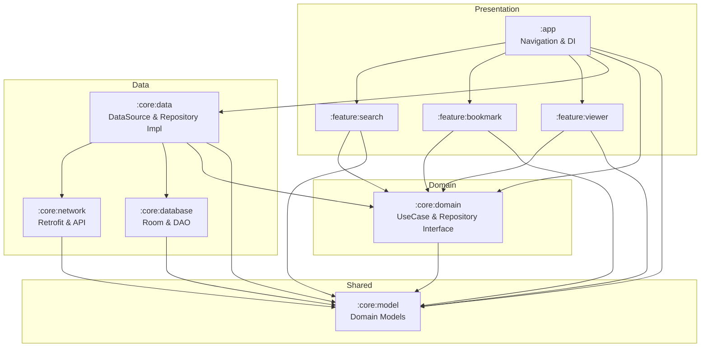

# 📸 ImageSearch

네이버 이미지 검색 API를 활용한 Android 이미지 검색 앱입니다.  
멀티 모듈 + 클린 아키텍처 기반으로 설계되었으며, 오프라인 캐싱과 Compose 최적화를 적용했습니다.

---

## 전체 아키텍처 흐름도



---

## 패키지 & 모듈 구조

```
ImageSearch/
├── app/                          ← 앱 진입점, Navigation, Application
├── build-logic/                  ← Convention Plugins (빌드 설정 공유)
├── core/
│   ├── data/                     ← DataSource, Repository Impl, RemoteMediator
│   ├── database/                 ← Room DB, DAO, Entity
│   ├── domain/                   ← UseCase, Repository Interface
│   ├── model/                    ← 공유 도메인 모델 (ImageItem, DataResult)
│   ├── network/                  ← Retrofit, API Interface, DTO
│   └── README.md                 ← Core 모듈 상세 문서
├── feature/
│   ├── search/                   ← 메인 탭(만화 자동 로드) 및 로컬 검색 화면
│   ├── bookmark/                 ← 북마크 관리 화면
│   └── viewer/                   ← 이미지 상세 뷰어
├── gradle/libs.versions.toml     ← 버전 카탈로그
└── README.md                     ← 이 문서
```

---

## 레이어별 역할

### Presentation Layer (`:app`, `:feature:*`)
- **Route-Screen 패턴** 적용: `Route`(Stateful)가 ViewModel과 상태를 연결하고, `Screen`(Stateless)은 순수 UI만 담당
- **화면 분리 및 관심사 격리**: `MainScreen`(API 자동 로드)과 `LocalSearchScreen`(로컬 DB 필터링)으로 역할 분리
- Jetpack Compose + Navigation으로 화면 전환 관리
- UiState는 Route → Screen → 하위 컴포넌트까지 명시적으로 전달

### Domain Layer (`:core:domain`)
- **비즈니스 로직 캡슐화**: UseCase 패턴으로 단일 책임 보장
- **Repository Interface**: 데이터 레이어와의 계약(Contract)만 정의
- Android/프레임워크 의존성 최소화 (Paging3만 예외적 허용)

### Data Layer (`:core:data`, `:core:network`, `:core:database`)
- **DataSource 브릿지**: Repository가 API/DAO를 직접 호출하지 않고 DataSource를 경유
- **Single Source of Truth (SSOT)**: RemoteMediator로 네트워크 ↔ Room 동기화
- 모듈 격리: `network`는 Room을 모르고, `database`는 Retrofit을 모름

### Shared Layer (`:core:model`)
- `ImageItem`, `DataResult` 등 순수 Kotlin 데이터 클래스
- 모든 모듈이 공통으로 참조하는 최하위 레이어

---

## 사용 라이브러리 & 용도

| 라이브러리 | 버전 | 용도 |
|---|---|---|
| **Jetpack Compose** | BOM 2024.09.00 | 선언형 UI 프레임워크 |
| **Material3** | Compose BOM | 디자인 시스템 (TopAppBar, Scaffold, Card 등) |
| **Navigation Compose** | 2.8.2 | 화면 전환 및 Deep Link 라우팅 |
| **Hilt** | 2.51.1 | 의존성 주입 (DI) |
| **Retrofit** | 2.11.0 | 네이버 이미지 검색 REST API 통신 |
| **OkHttp** | 4.12.0 | HTTP 클라이언트, 로깅 인터셉터, API 키 헤더 자동 삽입 |
| **KotlinX Serialization** | 1.7.3 | JSON 직렬화/역직렬화 (네트워크 DTO → 도메인 모델) |
| **Room** | 2.6.1 | 로컬 SQLite 데이터베이스 (북마크 영속 저장 + 검색 캐싱) |
| **Paging3** | 3.3.2 | 무한 스크롤 페이징 + RemoteMediator 오프라인 캐싱 |
| **Coil** | 2.7.0 | 이미지 로딩 및 메모리/디스크 캐싱 |
| **Gson** | 2.10.1 | Navigation 인자로 ImageItem 직렬화 전달 |
| **MockK** | 1.13.12 | Kotlin 친화적 Mocking 프레임워크 (단위 테스트) |
| **Turbine** | 1.2.0 | Flow/SharedFlow 테스트 유틸리티 |
| **Coroutines Test** | 1.9.0 | `runTest`, `StandardTestDispatcher` 기반 코루틴 테스트 |
| **Paging Test** | 3.3.6 | PagingData 단위 테스트 지원 |

---

## 프로젝트 코멘트 & 추가 설명

### Convention Plugins (build-logic)
`build-logic/` 디렉토리에 공통 빌드 설정을 Convention Plugin으로 추출하여 모든 모듈이 일관된 설정을 공유합니다:
- `imagesearch.android.library` — Android Library 공통 설정
- `imagesearch.android.compose` — Compose 컴파일러 설정
- `imagesearch.android.hilt` — Hilt 의존성 및 KSP 설정
- `imagesearch.android.network` — BuildConfig 기반 API 키/URL 주입

### Compose 최적화
- **`@Immutable` 어노테이션**: `ImageItem` 데이터 클래스에 적용하여 Compose 컴파일러에 안정성(Stability) 보장, Smart Recomposition 활성화
- **안정적 상태 타입**: 다중 선택 상태를 `List<ImageItem>` 대신 `Set<String>`(link 기반)으로 관리하여 불필요한 리컴포지션 방지
- **`itemKey` / `itemContentType`**: Paging3 LazyGrid에 안정적 키를 제공하여 불필요한 리컴포지션 차단
- **`graphicsLayer`**: 핀치 줌 애니메이션에서 Composition/Layout 단계를 건너뛰고 Draw만 갱신
- **`rememberSaveable`**: Configuration Change(화면 회전) 시 UI 상태 보존
- **Route-Screen 분리**: ViewModel 의존성을 Route에 격리하여 Screen의 재사용성과 테스트 용이성 확보
- **중복 캐싱 제거**: `cachedIn(viewModelScope)` 단일 호출로 PagingData 캐싱 최적화

### 오프라인 캐싱 전략 및 로컬 검색 (Local Filtering)
- **SSOT (Single Source of Truth)**: `RemoteMediator`가 API 응답을 Room에 캐싱하고, 모든 페이징은 Room에서만 이루어짐
- **로컬 검색 최적화**: 검색 페이지 진입 시 네이버 API를 중복 호출하지 않고, 이미 로드된 '만화' 데이터의 `title`을 대상으로 Room DB의 `LIKE %keyword%` 쿼리를 사용해 로컬 필터링 검색 수행
- 네트워크 불가 시 Room 캐시로 이전 검색 결과를 즉시 표시
- `fallbackToDestructiveMigration()`으로 개발 단계 스키마 변경 유연하게 대응

---

## 이미지 처리 코멘트

### 캐시 전략 (Coil)
`ImageSearchApplication`에서 `ImageLoaderFactory`를 구현하여 다음과 같이 튜닝:

| 캐시 유형 | 설정 | 설명 |
|---|---|---|
| **메모리 캐시** | `maxSizePercent = 0.20` | 앱 메모리의 20%를 이미지 캐시에 할당. OOM 방지와 캐시 히트 사이의 균형점 |
| **디스크 캐시** | `maxSizePercent = 0.02` | 전체 디스크의 2%만 사용. `image_cache` 디렉토리에 저장 |
| **네트워크 캐시** | 10MB 크기 할당 | `OkHttp` 클라이언트 단에 10MB의 네트워크 전용 캐시(`network_cache`) 구성 |
| **캐시 헤더** | `respectCacheHeaders(false)` | 서버 캐시 정책을 무시하고 자체 캐시 정책 우선 적용 |
| **Crossfade** | `crossfade(true)` | 이미지 로딩 완료 시 부드러운 페이드인 효과 |

### 이미지 보안 고려사항

> ⚠️ **현재 상태**: 네이버 API가 반환하는 이미지 URL(`thumbnail`, `link`)은 외부 호스트의 HTTP/HTTPS를 직접 참조합니다.

- **HTTPS 강제**: Android 9+ (API 28) 기본 정책으로 HTTPS만 허용. HTTP fallback이 필요한 경우 `network_security_config.xml`에서 명시적 설정 필요
- **Content Validation**: Coil이 응답 바이트를 디코딩할 때 유효 이미지 포맷(JPEG, PNG, WebP 등)인지 자동 검증
- **URL Encoding**: Navigation 인자로 이미지 URL 전달 시 `URLEncoder/URLDecoder`를 사용하여 특수문자 이스케이프 처리
- **캐시 격리**: Coil 디스크 캐시는 앱 프라이빗 디렉토리(`/data/data/<pkg>/cache/image_cache/`)에 저장되어 외부 앱 접근 불가

### 성능 최적화 포인트
- **Thumbnail vs Original**: 검색 그리드에서는 `thumbnail` (저해상도), 뷰어에서는 `link` (원본 URL)을 로드하여 대역폭 최적화
- **Lazy Loading**: Paging3의 `pageSize=50`으로 한 번에 50개씩 점진적 로딩
- **메모리 누수 방지**: `cachedIn(viewModelScope)`으로 PagingData를 ViewModel 범위에 바인딩

---

## 테스트

JUnit4 + MockK + Turbine 기반의 단위 테스트를 구성하여 UseCase 및 ViewModel의 성공/실패 시나리오를 검증합니다.

### 테스트 전략
- **UseCase 테스트**: Repository를 MockK으로 대체하여 비즈니스 로직만 검증
- **ViewModel 테스트**: UseCase를 MockK으로 대체하고, `StandardTestDispatcher`로 코루틴 제어, Turbine으로 Flow/SharedFlow 수집 검증
- **실패 케이스 포함**: 모든 테스트 대상에 대해 성공 경로와 실패 경로를 함께 작성
- **한글 테스트 네이밍**: 백틱(`` ` ``) 기반으로 테스트 의도를 한국어로 명시

### 테스트 커버리지

| 모듈 | 테스트 클래스 | 테스트 수 | 주요 검증 항목 |
|---|---|---|---|
| `:core:domain` | `ToggleBookmarkUseCaseImplTest` | 4 | 북마크 추가/제거 성공, DB 실패 시 Fail 반환 |
| `:core:domain` | `RemoveBookmarksUseCaseImplTest` | 3 | 다건 삭제 성공, 빈 리스트, 삭제 실패 |
| `:core:domain` | `GetRandomImagesUseCaseImplTest` | 3 | 랜덤 이미지 조회 성공, API 실패, 빈 결과 |
| `:feature:search` | `MainViewModelTest` | 6 | 북마크 토글 성공/실패, 다중 북마크 필터/일부 실패 |
| `:feature:search` | `SearchViewModelTest` | 5 | 초기 쿼리 상태, 쿼리 변경, 북마크 토글 성공/실패 |
| `:feature:bookmark` | `BookmarkViewModelTest` | 4 | Flow 수집, 빈 리스트, 삭제 성공/실패 |
| `:feature:viewer` | `ViewerViewModelTest` | 5 | 초기화 성공/실패, 중복 초기화 무시, 북마크 토글 |
| **합계** | **7개 클래스** | **30개** | |

### 테스트 실행

```bash
./gradlew :core:domain:testDebugUnitTest \
          :feature:search:testDebugUnitTest \
          :feature:bookmark:testDebugUnitTest \
          :feature:viewer:testDebugUnitTest
```
