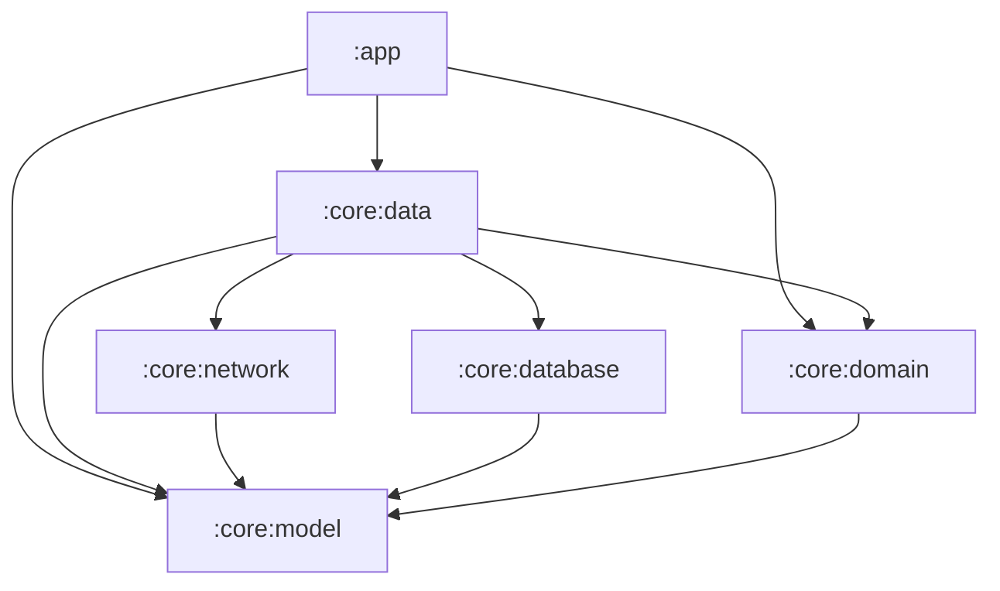

# Core Modules

`core/` 디렉토리는 앱의 핵심 비즈니스 로직과 데이터 흐름을 담당하는 모듈들의 집합입니다.  
각 모듈은 **단일 책임 원칙(SRP)**에 따라 명확한 역할을 가지며, 의존성은 항상 **단방향(↓)**으로만 흐릅니다.

---

## 의존성 그래프 (Dependency Graph)

---

## 모듈별 역할

### `:core:model`
> **순수 도메인 모델 (Plain Kotlin)**

- `ImageItem`, `DataResult` 등 앱 전체에서 공유하는 데이터 클래스를 정의합니다.
- **어떠한 Android/프레임워크 의존성도 갖지 않습니다.**
- 모든 모듈이 의존할 수 있는 최하단 모듈입니다.

### `:core:domain`
> **UseCase & Repository Interface**

- 비즈니스 로직을 캡슐화한 `UseCase` 클래스들이 위치합니다.
- `Repository` 인터페이스를 선언하여 데이터 레이어와의 계약(Contract)을 정의합니다.
- **구현체(Impl)를 알지 못합니다** — 의존성 역전 원칙(DIP)을 준수합니다.

### `:core:network`
> **네트워크 통신 전담 (Retrofit + OkHttp)**

- `NaverImageApi` (Retrofit 인터페이스) 및 API 응답 DTO(`ImageSearchResponse`, `ImageItemDto`)를 관리합니다.
- `NetworkModule` (Hilt DI)에서 OkHttp 클라이언트, Retrofit 인스턴스, API 키 인터셉터를 구성합니다.
- `BuildConfig`를 통해 `BASE_URL`, `NAVER_CLIENT_ID`, `NAVER_CLIENT_SECRET`을 안전하게 주입합니다.

### `:core:database`
> **로컬 저장소 전담 (Room Database)**

- `AppDatabase`, DAO(`BookmarkDao`, `SearchImageDao`, `SearchRemoteKeysDao`), Entity 클래스를 관리합니다.
- `DatabaseModule` (Hilt DI)에서 Room 인스턴스와 각 DAO를 제공합니다.
- 북마크 영속 저장 및 검색 결과 오프라인 캐싱을 담당합니다.

### `:core:data`
> **데이터 조립 모듈 (DataSource + Repository + RemoteMediator)**

- `DataSource` 인터페이스/구현체를 통해 `:core:network`와 `:core:database`를 간접 호출합니다.
- `Repository` 구현체(`ImageRepositoryImpl`, `BookmarkRepositoryImpl`)가 DataSource만 주입받아 동작합니다.
- `ImageRemoteMediator`가 네트워크와 DB를 오케스트레이션하여 Paging3 SSOT 캐싱을 수행합니다.

| DataSource | 역할 |
|---|---|
| `ImageRemoteDataSource` | 네이버 이미지 검색 API 호출 래핑 |
| `ImageLocalDataSource` | Room 검색 캐시 읽기/쓰기/트랜잭션 래핑 |
| `BookmarkLocalDataSource` | Room 북마크 CRUD 래핑 |

---

## 핵심 설계 원칙

1. **단방향 의존성**: 화살표는 항상 위에서 아래로만 흐릅니다. 순환 의존이 없습니다.
2. **DataSource 브릿지 패턴**: Repository가 DAO/API를 직접 호출하지 않고, DataSource를 거쳐 호출합니다.
3. **모듈 격리**: `core:network`는 Room을 모르고, `core:database`는 Retrofit을 모릅니다.
