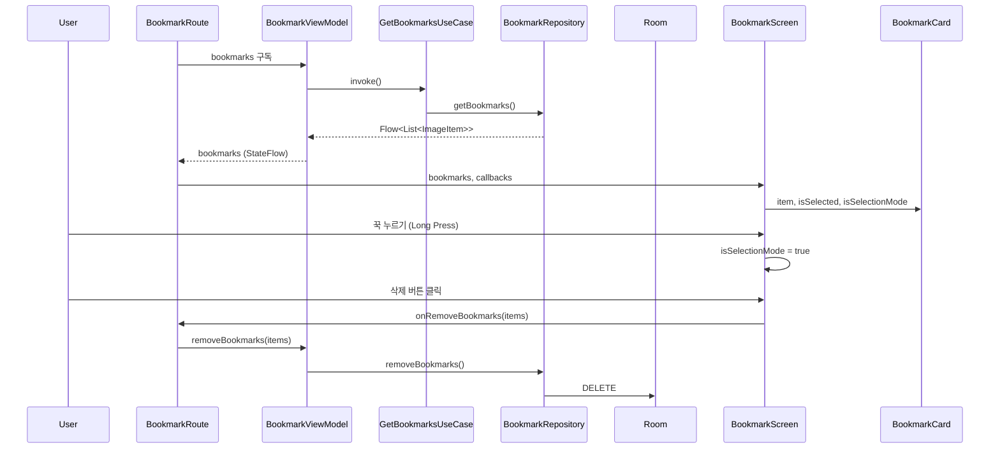

# :feature:bookmark

북마크(즐겨찾기) 관리 기능을 담당하는 Feature 모듈입니다.

## 화면 구조 (Route-Screen Pattern)

```
BookmarkRoute (Stateful)           ← ViewModel 주입 & 상태 수집
  └─ BookmarkScreen (Stateless)    ← 순수 UI 렌더링, Preview 가능
       └─ BookmarkCard             ← 개별 북마크 카드 (UiState 전달)
```

## 데이터 흐름도



## 주요 기능

| 기능 | 설명 |
|---|---|
| 실시간 동기화 | Room Flow로 북마크 추가/삭제 즉시 반영 |
| 다중 선택 삭제 | Long Press로 선택 모드 진입, 복수 항목 일괄 삭제 |
| 적응형 그리드 | 화면 폭 ≥600dp → 4열, 그 외 2열 |
| rememberSaveable | 화면 회전 시 선택 상태 보존 |

## 파일 구성

| 파일 | 역할 |
|---|---|
| `BookmarkScreen.kt` | BookmarkRoute + BookmarkScreen + BookmarkCard |
| `BookmarkViewModel.kt` | 북마크 목록 관리 및 삭제 로직 |
