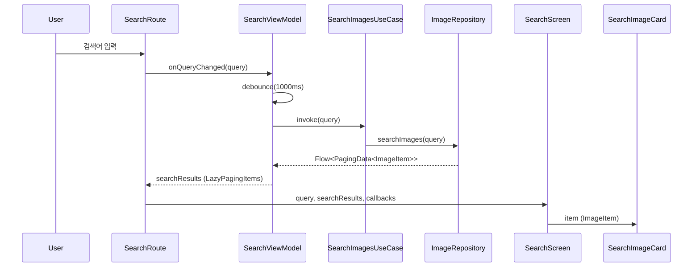

# :feature:search

네이버 이미지 검색 기능을 담당하는 Feature 모듈입니다.

## 화면 구조 (Route-Screen Pattern)

```
SearchRoute (Stateful)           ← ViewModel 주입 & 상태 수집
  └─ SearchScreen (Stateless)    ← 순수 UI 렌더링, Preview 가능
       └─ SearchImageCard        ← 개별 이미지 카드 (UiState 전달)
```

## 데이터 흐름도



## 주요 기능

| 기능 | 설명 |
|---|---|
| 디바운스 검색 | 입력 후 1초 대기 후 자동 검색 (불필요한 API 호출 방지) |
| Pull-to-Refresh | 당겨서 새로고침 (Paging3 SSOT 기반) |
| Shimmer 로딩 | 스켈레톤 UI로 로딩 상태 표시 |
| 적응형 그리드 | 화면 폭 ≥600dp → 4열, 그 외 2열 |
| 북마크 토글 | 검색 결과에서 즉시 북마크 추가/제거 |
| Snackbar 에러 | 네트워크 에러 시 Retry 액션 제공 |

## 파일 구성

| 파일 | 역할 |
|---|---|
| `SearchScreen.kt` | SearchRoute + SearchScreen + SearchImageCard |
| `SearchViewModel.kt` | 검색 쿼리 관리, Paging + Bookmark 상태 결합 |
| `ShimmerEffect.kt` | 로딩 애니메이션 Modifier 확장 |
