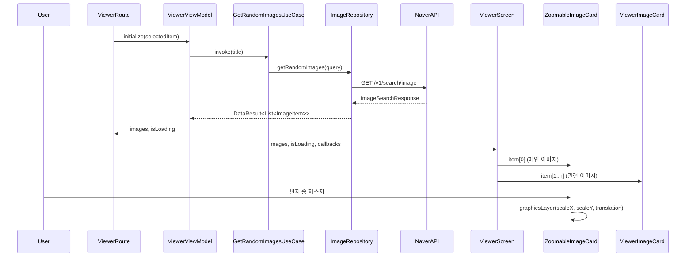

# :feature:viewer

이미지 상세 보기 및 관련 이미지 탐색 기능을 담당하는 Feature 모듈입니다.

## 화면 구조 (Route-Screen Pattern)

```
ViewerRoute (Stateful)             ← ViewModel 주입 & 상태 수집
  └─ ViewerScreen (Stateless)      ← 순수 UI 렌더링, Preview 가능
       ├─ ZoomableImageCard        ← 핀치 줌 지원 메인 이미지 (graphicsLayer 최적화)
       └─ ViewerImageCard          ← 관련 이미지 카드 (UiState 전달)
```

## 데이터 흐름도



## 주요 기능

| 기능 | 설명 |
|---|---|
| **핀치 줌** | 메인 선택 이미지(`item[0]`)에만 적용. `transformable` + `graphicsLayer`로 Draw 단계만 갱신 (성능 최적화) |
| **관련 이미지** | 선택한 이미지의 제목으로 랜덤 검색하여 하단에 유사 이미지 50개 표시 (`item[1..50]`) |
| **북마크 토글** | 뷰어 내에서 메인/관련 이미지 모두 우상단 아이콘을 통해 북마크 추가/해제 가능 |
| **UI 스타일링** | 반투명 배경(`surfaceVariant.copy(alpha=0.5f)`) 및 1dp 테두리, 넓은 카드 간 여백을 적용해 각 이미지 간의 시각적 분리감 제공 |

## 파일 구성

| 파일 | 역할 |
|---|---|
| `ViewerScreen.kt` | ViewerRoute + ViewerScreen + ZoomableImageCard + ViewerImageCard |
| `ViewerViewModel.kt` | 초기화, 관련 이미지 로드, 북마크 토글 |
