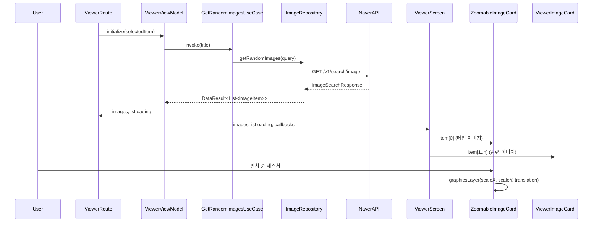

# :feature:viewer

이미지 상세 보기 및 관련 이미지 탐색 기능을 담당하는 Feature 모듈입니다.

## 화면 구조 (Route-Screen Pattern)

```
ViewerRoute (Stateful)             ← ViewModel 주입 & 상태 수집
  └─ ViewerScreen (Stateless)      ← 순수 UI 렌더링, Preview 가능
       ├─ ZoomableImageCard        ← 핀치 줌 지원 메인 이미지 (graphicsLayer 최적화)
       └─ ViewerImageCard          ← 관련 이미지 카드 (UiState 전달)
```

## 데이터 흐름도



## 주요 기능

| 기능 | 설명 |
|---|---|
| 핀치 줌 | `transformable` + `graphicsLayer`로 Draw 단계만 갱신 (고성능) |
| 관련 이미지 | 선택한 이미지의 제목으로 랜덤 검색하여 유사 이미지 표시 |
| 북마크 토글 | 뷰어 내에서 메인/관련 이미지 모두 북마크 가능 |

## 파일 구성

| 파일 | 역할 |
|---|---|
| `ViewerScreen.kt` | ViewerRoute + ViewerScreen + ZoomableImageCard + ViewerImageCard |
| `ViewerViewModel.kt` | 초기화, 관련 이미지 로드, 북마크 토글 |
